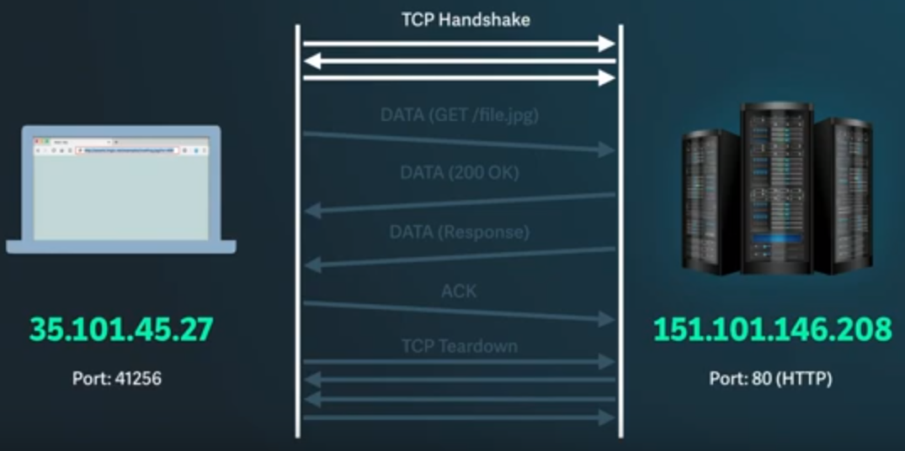
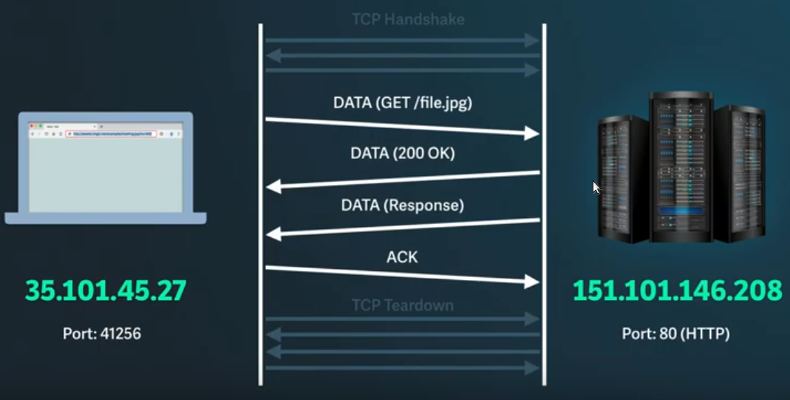

:data-transition-duration: 1000
:skip-help: true
:css: style.css
:substep: true
:slide-numbers: true

.. title: Blockchain Technology (By Ahmad Yoosofan)

.. role:: ltr
    :class: ltr

.. role:: rtl
    :class: rtl

----

CGI Programming
===================================================
Interacting with Webserver
------------------------------
Ahmad Yoosofan

University of Kashan

Spring 2020

----

simple Python server with GET

.. include:: cgi/ie982_code/01.simple.get.py
   :number-lines:
   :code: python

----

.. include:: cgi/ie982_code/01.almost.empty.html
   :number-lines:
   :code: html

----

.. image:: cgi/ie982_code/output/01.almost.empty.webbrowser.png
   :align: center

----

.. image:: cgi/ie982_code/output/01.almost.empty.server.png
   :align: center

----

----

https://www.whizlabs.com/blog/how-dns-works/

----

----

----

----

----

----

----

----

----

----

----

----

Instructions
======================
.. class:: substep

*  GET: fetch an existing resource. The URL contains all the necessary information the server needs to locate and return the resource.
*  POST: create a new resource. POST requests usually carry a payload that specifies the data for the new resource.
*  PUT: update an existing resource. The payload may contain the updated data for the resource.
*  DELETE: delete an existing resource.

----

Other Instructions
====================
.. class:: substep

*  HEAD: this is similar to GET, but without the message body. It's used to retrieve the server headers for a particular resource, generally to check if the resource has changed, via timestamps.
*  TRACE: used to retrieve the hops that a request takes to round trip from the server. Each intermediate proxy or gateway would inject its IP or DNS name into the Via header field. This can be used for diagnostic purposes.
*  OPTIONS: used to retrieve the server capabilities. On the client-side, it can be used to modify the request based on what the server can support.

----

Types of messages
==================================================================
1xx: Informational Messages
------------------------------------------------------------------
All HTTP/1.1 clients are required to accept the Transfer-Encoding header.

----

2xx: Successful
======================
.. class:: substep

*  202 Accepted: the request was accepted but may not include the resource in the response. This is useful for async processing on the server side. The server may choose to send information for monitoring.
*  204 No Content: there is no message body in the response.
*  205 Reset Content: indicates to the client to reset its document view.
*  206 Partial Content: indicates that the response only contains partial content. Additional headers indicate the exact range and content expiration information.

----

3xx: Redirection
========================
.. class:: substep

*  301 Moved Permanently: the resource is now located at a new URL.
*  303 See Other: the resource is temporarily located at a new URL. The Location response header contains the temporary URL.
*  304 Not Modified: the server has determined that the resource has not changed and the client should use its cached copy. This relies on the fact that the client is sending ETag (Enttity Tag) information that is a hash of the content. The server compares this with its own computed ETag to check for modifications.

----

4xx: Client Error
=======================
.. class:: substep

*  400 Bad Request: the request was malformed.
*  401 Unauthorized: request requires authentication. The client can repeat the request with the Authorization header. If the client already included the Authorization header, then the credentials were wrong.
*  403 Forbidden: server has denied access to the resource.
*  405 Method Not Allowed: invalid HTTP verb used in the request line, or the server does not support that verb.
*  409 Conflict: the server could not complete the request because the client is trying to modify a resource that is newer than the client's timestamp. Conflicts arise mostly for PUT requests during collaborative edits on a resource.

----

5xx: Server Error
=====================
.. class:: substep

*  501 Not Implemented: the server does not yet support the requested functionality.
*  503 Service Unavailable: this could happen if an internal system on the server has failed or the server is overloaded. Typically, the server won't even respond and the request will timeout.

----

Types of headers
==================================================================
General Headers
-------------------------------------------------------------------
.. class:: substep

*  Via header is used in a TRACE message and updated by all intermittent proxies and gateways
*  Pragma is considered a custom header and may be used to include implementation-specific headers. The most commonly used pragma-directive is Pragma: no-cache, which really is Cache-Control: no-cache under HTTP/1.1. This will be covered in Part 2 of the article.
*  The Date header field is used to timestamp the request/response message
*  Upgrade is used to switch protocols and allow a smooth transition to a newer protocol.
*  Transfer-Encoding is generally used to break the response into smaller parts with the Transfer-Encoding: chunked value. This is a new header in HTTP/1.1 and allows for streaming of response to the client instead of one big payload.

----

Entity headers
=========================
.. class:: substep

*  Allow                    
*  Content-Encoding  
*  Content-Language  
*  Content-Length    
*  Content-Location  
*  Content-MD5       
*  Content-Range     
*  Content-Type      
*  Expires           
*  Last-Modified

----
               
Request Format
=========================
address binding, loader
-------------------------------------
.. image:: img/http_get_header.png
   :align: center

----

.. image:: img/http_get_timing.png
   :align: center

----

.. comments:

    rst2html.py http.rst http.html --stylesheet=../../tools/farsi.css,html4css1.css

    https
    ===============================================================
    https://www.digitalocean.com/community/tutorials/http-1-1-vs-http-2-what-s-the-difference?utm_medium=email&utm_source=IaaN&utm_campaign=02142019
    https://www.digitalocean.com/community/tutorials?utm_medium=email&utm_source=IaaN&utm_campaign=02142019

    javascript differenct hash and crypto based algorithms
    ===============================================================

    https://gchq.github.io/CyberChef/

    https://onezero.medium.com/the-end-of-app-stores-is-rapidly-approaching-b972da395097?utm_medium=email&utm_source=topic+optin&utm_campaign=awareness&utm_content=20190529+web+nl&mkt_tok=eyJpIjoiWVdRMU1qTTVaR05oTURVMSIsInQiOiJsWVR2aWp3TnlXQk5yMEh1aVMyenFrR3NtaTRMVHRnWVNLSjdKYjRnYmgrRmZrWGU1TWI2Z0R4cldFWGxUVTF4ZTFPZkVna3ZMZDh4dnNzUnl3anFtUk1sS2FBM3YxVTJMWFZlSGhrcHRadm91RVRQTXQySm81M1hXc2JoTlVYQiJ9

    https://code.tutsplus.com/tutorials/http-the-protocol-every-web-developer-must-know-part-1--net-31177
    https://en.wikipedia.org/wiki/HTTP/2
    https://en.wikipedia.org/wiki/HTTPS
    https://en.wikipedia.org/wiki/List_of_HTTP_header_fields
    https://en.wikipedia.org/wiki/List_of_HTTP_status_codes
    https://en.wikipedia.org/wiki/Representational_state_transfer
    https://en.wikipedia.org/wiki/Roy_Fielding
    https://www.dartlang.org/tutorials/dart-vm/httpserver
    http://www.wpbeginner.com/wp-tutorials/how-to-add-ssl-and-https-in-wordpress/
    https://www.tutorialspoint.com/security_testing/https_protocol_basics.htm
    https://www.ntu.edu.sg/home/ehchua/programming/webprogramming/HTTP_Basics.html
    https://developer.mozilla.org/en-US/docs/Web/HTTP
    https://en.wikipedia.org/wiki/Basic_access_authentication
    https://en.wikipedia.org/wiki/Hypertext_Transfer_Protocol
    https protocol tutorial

