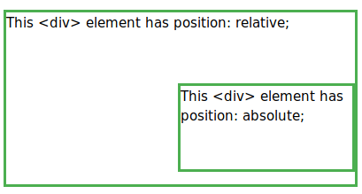

.. meta::
   :http-equiv=Content-Language: fa

..  section-numbering::

.. role:: ltr
    :class: ltr

####################################################################################################
CSS
####################################################################################################
جدا کردن محتوا از شکل نمایش
####################################################################################################
مخلوط بودن انواع تگ‌ها برای مشخص کردن رنگ و همانند

هر چقدر در بخش داده و محتوا چیزی از نوع رنگ‌ها و دیگر ویژگی‌های نمایشی نباشد بهتر است.

به مفهوم متن بیشتر نزدیک می‌شویم

بدون CSS
####################################################################################################
.. code:: html

    <!DOCTYPE html>
    <html dir="ltr">
    <head>
      <meta charset="utf-8">
      <title>CSS 01 sample</title>
      
    </head>
    <body>
      <h1>CSS 01 sample</h1>
      

        <ul>
          <li><a href=/about>About</a>
          <li><a href=/projects>Projects</a>
          <li><a href=/interact>Interact</a>
          <li><a href="#ggg222">this</a></li>
          <li id='login'><a href=/login>Login</a>
        </ul>
      

    

    

      test1
    

    

      <table border="1px"><tr><td>01</td><td>02</td></tr></table>
    

    </body>
    </html> 

`Without css <css/css00.html>`_

نمونه ۰۱
####################################################################################################

.. code:: html

    <!DOCTYPE html>
    <html dir="ltr">
    <head>
      <meta charset="utf-8">
      <title>CSS 01 sample</title>
      
    </head>
    <body>
      <h1>CSS 01 sample</h1>
      

        <ul>
          <li><a href=/about>About</a>
          <li><a href=/projects>Projects</a>
          <li><a href=/interact>Interact</a>
          <li><a href="#ggg222">this</a></li>
          <li id='login'><a href=/login>Login</a>
        </ul>
      

    

    

      test1
    

    

      <table border="1px"><tr><td>01</td><td>02</td></tr></table>
    

    </body>
    </html> 

`<css/css01.html>`_

چگونه یک عنصر را مشخص کنیم و ویژگی‌ای به آن بدهیم
####################################################################################################
selector {property: value;}

ساده‌ترین حالت به صورت زیر است

نام یک تگ
{
یک ویژگی از تگ:
مقدار مورد نظر برای تگ
}

مقدار حاشیه جدول را تغییر داده‌ایم

.. code:: html
    :number-lines:

      

`<css/css02.html>`_

تغییر یک عنصر خاص
****************************************************************************************************
برای تغییر یک عنصر خاص باید برای آن شناسه مشخص کنیم
یعنی 
id
را به عنوان یکی از ویژگی‌های آن عنصر در درون تگ آن بگذاریم
شناسه‌های درون یک 
html
باید یکتا باشند

.. code:: html

    <table id="id001">

در بخش 
style
می‌توانیم آن را به کار ببریم

.. code:: css

  #id001 {color: red;}

بنابراین نمونهٔ زیر می‌تواند چند جدول داشته باشد که یکی رنگ قرمز و دیگری آبی داشته باشد.
  
.. include:: css/css03.html
  :code: html
  :number-lines:
  :class: ltr

`<css/css03.html>`_

تغییر یک گروه از عنصرها
****************************************************************************************************
برای گروه بندی چند عنصر می‌توان از ویژگی
class
در تگ‌ها کمک گرفت

.. code:: html

    <table class="group01">
    
    ...

    

    ...

.. code:: css

    .group01 {color:yellow;}

.. include:: css/css04.html
  :code: html
  :number-lines:
  :class: ltr

`<css/css04.html>`_

توضیح دربارهٔ رنگ‌ها
####################################################################################################
تعدادی از رنگ‌ها با نام مشخص می‌شوند و می‌توانیم در css آنها را به کار ببریم.

سه رنگ اصلی که دیگر رنگ‌ها از ترکیب آنها به وجود می‌آیند و با توجه به درصد آن رنگ بقیه مشخص می‌شود. 
رنگ‌های

* آبی
* قرمز
* سبز

که به صورت RGB
نوشته می‌شوند با کمک این سه رنگ می‌توانیم انواع رنگ‌ها را مشخص کنیم.

در css برای هر عنصر می‌توانیم رنگ‌های سه بخش آن را تغییر دهیم

* background-color.
* use color
* border-color.

به دو صورت می‌توانیم رنگ‌ها را مشخص کنیم

.. code:: css

    border-color: #0000ff;

    background-color: rgb(0,0,255);

بحث دربارهٔ فونت
####################################################################################################

.. code:: css

        font-family: sans-serif;
        font-size: 1.3em;

CSS Display and Positioning
####################################################################################################
Flow of HTML
****************************************************************************************************
A browser will render the elements of an HTML document that has no CSS from left to right, top to bottom, in the same order as they exist in the document. This is called the flow of elements in HTML.

In addition to the properties that it provides to style HTML elements, CSS includes properties that change how a browser positions elements. These properties specify where an element is located on a page, if the element can share lines with other elements, and other related attributes.

In this lesson, you will learn five properties for adjusting the position of HTML elements in the browser:

*    position
*    display
*    z-index
*    float
*    clear

Each of these properties will allow us to position and view elements on a web page. They can be used in conjunction with any other styling properties you may know.

.. include:: css/css21_layout_without_css.html
  :code: html
  :number-lines:
  :class: ltr

without css
`<css/css21_layout_without_css.html>`_

.. code:: html

      <link rel="stylesheet" type="text/css" href="css21_layout.css">

Adding font

.. code:: html

      <link rel="stylesheet" type="text/css" href="css21_layout.css">

.. include:: css/css21_layout.html
  :code: html
  :number-lines:
  :class: ltr

.. include:: css/css21_layout.css
  :code: css
  :number-lines:
  :class: ltr

`<css/css21_layout.html>`_

Position
****************************************************************************************************
Take a look at the block-level elements in the image below:

.. image::   css22_layout_html_fig1.png
   :align: center
   :scale: 90%

Block-level elements like these boxes create a block the full width of their parent elements, and they prevent other elements from appearing in the same horizontal space. The boxes in the image above were created with the following CSS:

.. code:: css

    .boxes {
      width: 120px;
      height: 70px;
    }

and the following HTML:

.. code:: html

    

    

Notice the block-level elements in the image above take up their own line of space and therefore don’t overlap each other. In the browser to the right you can see block-level elements also consistently appear on the left side of the browser. This is the default position for block-level elements.

The default position of an element can be changed by setting its position property. The position property can take one of four values:

*    static - the default value (it does not need to be specified)
*    relative
*    absolute
*    fixed

In the next few exercises, you’ll learn about the values in items 2, 3, and 4 above. For now, it’s important to understand that if you favor the default position of an HTML element, you don’t need to set its position property.

Instructions

1.In style.css, set the position in .question to static.

Notice that setting position to static does nothing. That’s because static simply refers to the default behavior.

Static
===================================================================================================
HTML elements are positioned static by default.

Static positioned elements are not affected by the top, bottom, left, and right properties.

An element with position: static; is not positioned in any special way; it is always positioned according to the normal flow of the page:

**Position: static** is the default value that an element will have. This means if you don’t declare **position** for an element in CSS, it will automatically be set to **static**.

It’s important to note that having a static position is the same as not setting the **position** property at all. (This will come into play a bit later on with absolute positioning.)

Elements that are statically positioned will appear on the page in what we call the normal flow. For example, if you have multiple **
** elements one after the other, they will appear on the page directly below one another.

Here’s a quick demo to illustrate static position. We are using the following HTML markup:

.. code:: css

    

      position: static
    

    

      position: static 
      top: 50px (this has no effect)
    

And here’s the CSS we’re using:

.. code:: css

    .first {  
      // No position set, so it's static
    }

    .another {
      // No position set, so it's static
      top: 50px;
    }

.. include:: css/css23_layout_static1.html
  :code: html
  :number-lines:
  :class: ltr

.. include:: css/css23_layout_static1.css
  :code: css
  :number-lines:
  :class: ltr

`<css/css23_layout_static1.html>`_

Since both elements have a static position, none of the layout CSS properties will do anything. This makes that **top** property have no effect on how the second element is displayed.

So that second element ends up being directly below the first element, with no space between.

How can we fix this? Let’s move on to the next position:

Position: relative
===================================================================================================
An element with position: relative; is positioned relative to its normal position.

Setting the top, right, bottom, and left properties of a relatively-positioned element will cause it to be adjusted away from its normal position. Other content will not be adjusted to fit into any gap left by the element.

**Position: relative** is similar to **static** in that relatively positioned elements will follow the normal flow of the webpage. But the main difference is that using **relative** will now unlock the other CSS layout properties.

Think about it this way: you are setting the element to be positioned relative to other elements on the page.

Let’s see what this looks like, and adjust our CSS like this

.. code:: css

    .first {
      position: static;
    }

    .another {
      position: relative;  
      top: 50px;
    }

All the CSS is exactly the same, except that we changed the second element to use **position: relative** . Doing this makes that **top: 50px** work!

.. include:: css/css24_layout_static2.html
  :code: html
  :number-lines:
  :class: ltr

.. include:: css/css24_layout_static2.css
  :code: html
  :number-lines:
  :class: ltr

`<css/css24_layout_static2.html>`_

Relatively positioned parent and child elements
---------------------------------------------------------------------------------------------------
Let’s try another example, using a parent element with a child element nested inside it. Both have **position: relative** set.

Here’s the HTML for that:

.. code:: html

    
  
      

    

And our CSS styles:

.. code:: css

    .parent {  
      position: relative;  
    }

    .child {
      position: relative;
      top: 0px;
      left: 0px;
    }

And here’s what that code will look like in real life:

.. include:: css/css25_layout_relative2.html
  :code: html
  :number-lines:
  :class: ltr

.. include:: css/css25_layout_relative2.css
  :code: css
  :number-lines:
  :class: ltr

`<css/css25_layout_relative2.html>`_

You can see that the pink child element is nicely nested inside the purple parent element. The child is also positioned as close to the top and left inside the parent as is possible. (It will go as far up as the parent text)

Position relative is relatively straight-forward, right? Well, hold on to your hats, because things are about to get crazy with **position absolute**.

Position: Absolute
===================================================================================================
An element with position: absolute; is positioned relative to the nearest positioned ancestor (instead of positioned relative to the viewport, like fixed).

However; if an absolute positioned element has no positioned ancestors, it uses the document body, and moves along with page scrolling.

Note: A "positioned" element is one whose position is anything except static.

Here is a simple example:

Position: absolute will cause an element to be taken out of that normal flow of the webpage.

So before, using static or relative positioning, elements would be nicely displayed one below the other, depending on their order in the HTML markup. But with absolute positioning, the element is completely taken out of that entire flow.

To help explain, let’s do a comparison to illustrate the difference between relative and absolute positioning.

In the previous example, we had a parent element with a child element, both positioned relatively. And the child was nested inside the parent element.

Let’s change that child to be positioned absolutely in the parent!

Our CSS will now look like this:

.. code:: css

    .parent {  
      position: relative;  
    }

    .child {
      position: absolute;
      top: 0px;
      left: 0px;
    }

.. include:: css/css26_layout_absolute1.html
  :code: html
  :number-lines:
  :class: ltr

.. include:: css/css26_layout_absolute1.css
  :code: css
  :number-lines:
  :class: ltr

`<css/css26_layout_absolute1.html>`_

The pink child element now looks very different from our last example.

While it is still within the confines of the parent element, it is positioned at the very top and very left of the parent. It’s even covering up the parent text content!

This is due to the top: 0px and left: 0px styles of the child, combined with the child being absolutely positioned. In the normal flow of things, elements wouldn’t be on top of (and covering up) other elements.

But since the child is absolute, it’s essentially on a different layer than the normal elements. So it can be positioned on top of what else is on the webpage.

But it will stay within the boundaries of the parent element– as long as the parent has its position set. Which leads us to our next point.

There is one other tricky aspect to child elements with absolute positioning…

An absolutely positioned element needs to position itself in relation to a positioned ancestor.
---------------------------------------------------------------------------------------------------
When you take an element out of the normal flow by using position: absolute, it will look for an ancestor element that has its own position set. This is so the child knows what element it should position itself in relation to.

So what happens if a child element is absolutely positioned, but the parent element doesn’t have a position set?

Here’s our CSS for this illustration:

.. code:: css

    .parent {  
      // No position set, so it's static
    }

    .child {
      position: absolute;
      top: 0px;
      left: 0px;
    }

.. include:: css/css27_layout_absolute2.html
  :code: html
  :number-lines:
  :class: ltr

.. include:: css/css27_layout_absolute2.css
  :code: css
  :number-lines:
  :class: ltr

`<css/css27_layout_absolute2.html>`_

The child has now escaped the confines of the parent element, since the parent has no position set. And the child has gone up to the next (grand)parent element, in this case the <body> element, which is as far as it can go.

(A somewhat sad metaphor would be that this “orphaned” child is looking up the ancestry tree for someone that will be its “parent.”)

This is a huge cause of unexpected behavior in CSS for many developers.

If you can remember to always set the parent element of a child element to have position set to relative or absolute (in most cases), you will avoid having your child elements flying up the page to who knows where 😊

So, to summarize relative and absolute positioning:

The main difference between relative and absolute positioning is that position: absolute will take a child element completely out of the normal flow of the document. And that child will be positioned in relation to the first parent element that has its own position set.

The last two position values, fixed and sticky, are similar in some ways to position: absolute. But they also are related to your scroll position on the page.

Position: Fixed
===================================================================================================
Position: fixed will take the element out of the normal flow, and also position it in the same place in the viewport (what’s visible on screen). This means that scrolling will not affect its position at all.

Let’s see what this looks like in the code. Here’s our HTML:

.. code:: html

    

      Lorem ipsum dolor sit amet, consectetur adipiscing elit....
    

    

And in our CSS, we’ve set the second element to be position: fixed:

.. code:: css

    .first {
      position: relative;
    }

    .another {
      position: fixed;  
      top: 0px;
      left: 0px;
    }

.. include:: css/css28_layout_fixed1.html
  :code: html
  :number-lines:
  :class: ltr

.. include:: css/css28_layout_fixed1.css
  :code: css
  :number-lines:
  :class: ltr

`<css/css28_layout_fixed1.html>`_

The green fixed element will stay positioned to the top and left corner of the viewport. And if you scroll, the purple element will scroll up normally, but the green element will remain stuck to where we positioned it.

Position: fixed is commonly used to make navigation bars that are always affixed to the top. It’s a super helpful property!

Next, we’ll take a look at sticky positioning, which is like fixed positioning but with a little extra.

media queries
****************************************************************************************************

https://www.w3schools.com/css/css3_mediaqueries.asp

.. code:: css

    @media screen and (min-width:600px) {
      nav {
        float: left;
        width: 25%;
      }
      section {
        margin-left: 25%;
      }
    }
    @media screen and (max-width:599px) {
      nav li {
        display: inline;
      }
    }

flexbox
##################################
https://tobiasahlin.com/blog/common-flexbox-patterns/
https://www.freecodecamp.org/news/flexbox-the-ultimate-css-flex-cheatsheet/
https://developer.mozilla.org/en-US/docs/Web/CSS/CSS_Flexible_Box_Layout/Basic_Concepts_of_Flexbox
https://www.ostraining.com/blog/webdesign/css-flexbox-the-flex-basis-property/
https://www.ostraining.com/blog/webdesign/css-flexbox-the-flex-basis-property/

Cheat sheets
############################################
html
************
https://htmlcheatsheet.com

https://www.w3schools.com/tags/tag_area.asp
https://developer.mozilla.org/en-US/docs/Web/HTML/Element/area
https://html.com/tags/area/
https://hackr.io/blog/html-cheat-sheet

https://sharethis.com/best-practices/2020/02/best-html-and-css-cheat-sheets/

https://www.webucator.com/how-to/how-create-css-external-style-sheet.cfm
https://www.w3schools.com/css/css_howto.asp
https://developer.mozilla.org/en-US/docs/Web/HTML/Element/area

css
***********
https://htmlcheatsheet.com/css/
https://www.rankred.com/css-cheat-sheets/
https://www.templatemonster.com/blog/css3-cheat-sheet-pdf/
https://cssauthor.com/html-and-css-cheat-sheets/
https://www.hostinger.com/tutorials/css-cheat-sheet
https://speckyboy.com/css-cheatsheets-resources-guides/
https://www.styleshout.com/must-have-css-cheat-sheets-for-web-designers/

CSS grid
******************
https://learn.freecodecamp.org/responsive-web-design/css-grid/

https://www.w3schools.com/css/css_grid.asp

https://www.w3schools.com/css/css_grid_container.asp

https://www.w3schools.com/css/css_grid_item.asp

https://www.w3schools.com/css/css_templates.asp

https://developer.mozilla.org/en-US/docs/Web/CSS/CSS_Grid_Layout#CSS

https://developer.mozilla.org/en-US/docs/Web/CSS/CSS_Grid_Layout/Basic_Concepts_of_Grid_Layout

`CSS Grid Generator <https://cssgrid-generator.netlify.com/>`_

https://www.cssgrid.cc/css-grid-guide.html

https://css-tricks.com/snippets/css/complete-guide-grid/

`free videos <https://cssgrid.io/>`_

`browser support <https://caniuse.com/#feat=css-grid>`_

https://learncssgrid.com/

https://gridbyexample.com/examples/

https://www.w3.org/TR/css-grid-1/

flex vs grig
******************
https://www.alsacreations.com/article/lire/1794-flexbox-ou-grid-layout.html

polygon

https://bennettfeely.com/clippy/

*  https://coder-coder.com/css-position-layout/
*  https://www.w3schools.com/Css/css_positioning.asp

*  https://www.codecademy.com/learn/learn-css
*  https://www.w3schools.com
*  https://css-tricks.com/
*  https://developer.mozilla.org/en-US/docs/Learn/CSS/First_steps
*  https://www.quackit.com/
*  https://www.quackit.com/css/css_color_codes.cfm
*  https://coder-coder.com/css-position-layout/
*  http://learnlayout.com/position-example.html
*  https://dev.opera.com/articles/an-introduction-to-meta-viewport-and-viewport/
*  https://developer.mozilla.org/samples/cssref/css-positioning.html

.. comments:

    rst2html.py css.rst css.html --stylesheet=../../tools/farsi.css,html4css1.css
    rst2html.py css.rst css.html

    * `Pro CSS3 Layout Techniques <http://www.apress.com/9781430265023>`_
    * https://github.com/apress/pro-css3-layout-techniques
    * https://www.traversymedia.com/
    * https://www.youtube.com/watch?v=0ik6X4DJKCc&t=285s
