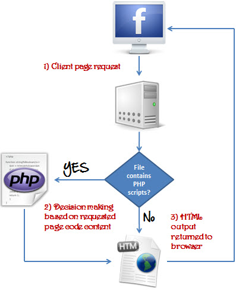
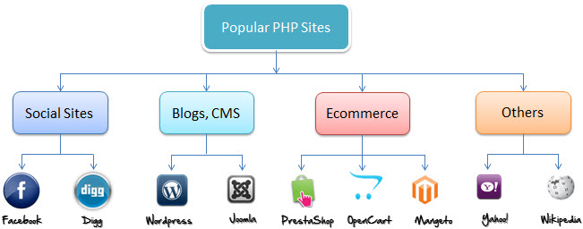
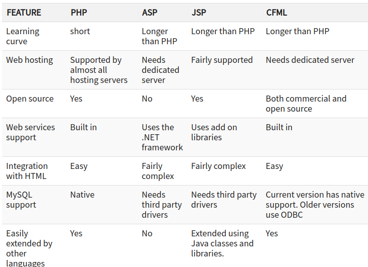

:data-transition-duration: 1000
:skip-help: true
:css: style.css
:substep: true
:slide-numbers: true

.. title: PHP (By Ahmad Yoosofan)

.. role:: ltr
    :class: ltr

.. role:: rtl
    :class: rtl

----

PHP overview
===================================================
Ahmad Yoosofan

University of Kashan

Spring 2020

----

`link <https://www.guru99.com/what-is-php-first-php-program.html>`_

----

`link <https://www.guru99.com/what-is-php-first-php-program.html>`_

----

`link <https://www.guru99.com/what-is-php-first-php-program.html>`_

----

PHP File Extensions
=========================

* .php
* .phtml
* .php3
* .php4
* .php5
* .phps

----

Hello world
=================

.. code:: php

    <?php
    echo "Hello world";
    ?>

----

Simple full sample
===================

.. code:: php

    <!DOCTYPE html>
    <html>
    <body>

    <?php
    echo "My first PHP script!";
    ?>

    </body>
    </html> 

----

Variables
===============

.. code:: php

    <?php
    // Assign the value "Hello!" to the variable "greeting"
    $greeting = "Hello!";
    // Assign the value 8 to the variable "month"
    $month = 8;
    // Assign the value 2019 to the variable "year"
    $year = 2019;
    ?>

https://www.freecodecamp.org/news/the-best-php-examples/

----

Predefined Variables
==========================
*   $this
*   $_GET
*   $_POST
*   $_SERVER
*   $_FILES

----

PHP Data Types
=================
*   String ("Hello")
*   Integer (5)
*   Float (also called double) (1.0)
*   Boolean ( 1 or 0 )
*   Array ( array("I", "am", "an", "array") )
*   Object
*   NULL
*   Resource

https://www.freecodecamp.org/news/the-best-php-examples/

----

Classes and Objects
========================
.. code:: php

    <?php
    class Car {
        function Car() {
            $this->model = "Tesla";
        }
    }

    // create an object
    $Lightning = new Car();

    // show object properties
    echo $Lightning->model;
    ?>

https://www.freecodecamp.org/news/the-best-php-examples/

----

PHP Resource
========================
.. code:: php

    <?php
    // prints: mysql link
    $c = mysql_connect();
    echo get_resource_type($c) . "\n";

    // prints: stream
    $fp = fopen("foo", "w");
    echo get_resource_type($fp) . "\n";

    // prints: domxml document
    $doc = new_xmldoc("1.0");
    echo get_resource_type($doc->doc) . "\n";

https://www.freecodecamp.org/news/the-best-php-examples/

----

Constants
========================
.. code:: php

    <?php
    define("freeCodeCamp", "Learn to code and help nonprofits", false);
    echo freeCodeCamp;
    >?

    // Output: Learn to code and help nonprofits

https://www.freecodecamp.org/news/the-best-php-examples/

----

switch
========================
.. code:: php

    // Switch Statement Example
    switch ($i) {
        case "free":
            echo "i is free";
        break;
        case "code":
            echo "i is code";
        break;
        case "camp":
            echo "i is camp";
        break;
        default:
            echo "i is freecodecamp";
        break;
    }

https://www.freecodecamp.org/news/the-best-php-examples/

----

for loop
========================
.. code:: php

    <?php
    for($index = 0; $index < 5; $index ++)
    {
        echo "Current loop counter ".$index.".\n";
    }
    ?>

https://www.freecodecamp.org/news/the-best-php-examples/

----

while loop
========================
.. code:: php

    $index = 10;
    while ($index >= 0)
    {
        echo "The index is ".$index.".\n";
        $index--;
    }
    ?>

https://www.freecodecamp.org/news/the-best-php-examples/

----

do while loop
========================
.. code:: php

    $index = 3;
    do
    {
        // execute this at least 1 time
        echo "Index: ".$index.".\n"; 
        $index --;
    }
    while ($index > 0);
    ?>

https://www.freecodecamp.org/news/the-best-php-examples/

----

foreach
========================
.. code:: php

    function makeItBIG($a_lot_of_names) {
      foreach($a_lot_of_names as $the_simpsons) {
        $BIG[] = strtoupper($the_simpsons);
      }
      return $BIG;
    }

    $a_lot_of_names = ['Homer', 'Marge', 'Bart', 'Maggy', 'Lisa'];
    var_dump(makeItBIG($a_lot_of_names));

https://www.freecodecamp.org/news/the-best-php-examples/

----

Arrays
========================
.. code:: php

    $students = 
      array(
        array("first_name" => "Joe", "score" => 83, "last_name" => "Smith"),
        array("first_name" => "Frank", "score" => 92, "last_name" => "Barbson"),
        array("first_name" => "Benji", "score" => 90, "last_name" => "Warner")   
      );

https://www.freecodecamp.org/news/the-best-php-examples/

----

forms (1)
========================
.. code:: html

    <html>
    <body>
      <form method="get" action="target_proccessor.php">
          <input type="search" name="search" /> 
          <input type="submit" name="submit" value="Search" /> 
      </form>
    <body>
    </html>

https://www.freecodecamp.org/news/the-best-php-examples/

----

forms (2)
========================
.. code:: php

    echo ' <!DOCTYPE html>     <html lang="en">  ';
    echo '   <head><title>PHP Associative Array</title></head> ';
    echo '<body> ';

    $firstName = $_GET['search']

    if(isset($firstName)){
      echo "firstName field is set". " ";
    }
    else{
      echo "The field is not set."." ";
    }

https://www.freecodecamp.org/news/the-best-php-examples/

----

String replace
========================
.. code:: php

    <!DOCTYPE html>
    <html lang="en">
    <head>
        <title>PHP Replacing Text within a String</title>
    </head>
    <body>

    <?php
    $my_str = 'If the facts do not fit the theory, change the facts.';
     
    // Display replaced string
    echo str_replace("facts", "truth", $my_str);
    ?>

    </body>
    </html>                                		

https://www.tutorialrepublic.com/php-examples.php

----

.. code:: php

    <!DOCTYPE html>
    <html lang="en">
    <head> <title>PHP Arithmetic Operators</title> </head>
    <body>
    <?php
    $x = 10;        $y = 4;
    echo($x + $y);  echo " ";
    echo($x - $y);  echo " ";
    echo($x * $y);  echo " ";
    echo($x / $y);  echo " ";
    echo($x % $y);
    ?>
    </body>
    </html>                                		

----

.. code:: php

    <!DOCTYPE html>
    <html lang="en">
    <head><title>PHP Comparison Operators</title></head>
    <body>
    <?php
    $x = 25;    $y = 35;  $z = "25";
    var_dump($x == $z);  echo " ";
    var_dump($x === $z); echo " ";
    var_dump($x != $y);  echo " ";
    var_dump($x !== $z); echo " ";
    var_dump($x < $y);   echo " ";
    var_dump($x > $y);   echo " ";
    var_dump($x <= $y);  echo " ";
    var_dump($x >= $y);
    ?>
    </body></html>                                		

----

.. code:: php

    <!DOCTYPE html>
    <html lang="en">
    <head><title>PHP Logical Operators</title></head>
    <body>
    <?php
    $year = 2014;// Leap years are divisible by 400 or by 4 but not 100
    if(($year % 400 == 0) || (($year % 100 != 0) && ($year % 4 == 0))){
        echo "$year is a leap year.";
    } else{echo "$year is not a leap year.";}
    ?>
    </body>
    </html>                                		

----

.. code:: php

    <!DOCTYPE html>
    <html lang="en">
    <head><title>PHP Associative Array</title></head>
    <body>
    <?php
    $ages = array("Peter"=>22, "Clark"=>32, "John"=>28);
    print_r($ages); // Printing array structure
    ?>
    </body>
    </html>                                		

----

Simple Date and Time(1)
=========================

.. code:: php

    ?php
    $raw = '22. 11. 1968';
    $start = DateTime::createFromFormat('d. m. Y', $raw);

    echo 'Start date: ' . $start->format('Y-m-d') . "\n";

https://phptherightway.com/

----

Simple Date and Time (2)
=========================

.. code:: php

    <?php
    // create a copy of $start and add one month and 6 days
    $end = clone $start;
    $end->add(new DateInterval('P1M6D'));

    $diff = $end->diff($start);
    echo 'Difference: ' . $diff->format('%m month, %d days (total: %a days)') . "\n";
    // Difference: 1 month, 6 days (total: 37 days)

https://phptherightway.com/

----

Change headers
=========================

.. code:: php

    <?php
    header('Content-Type: text/html; charset=UTF-8')

https://phptherightway.com/

----

PDO
=========

https://www.w3resource.com/php/pdo/php-pdo.php

https://www.zentut.com/php-pdo/

----

.. comments:

    rst2html.py http.rst http.html --stylesheet=../../tools/farsi.css,html4css1.css

